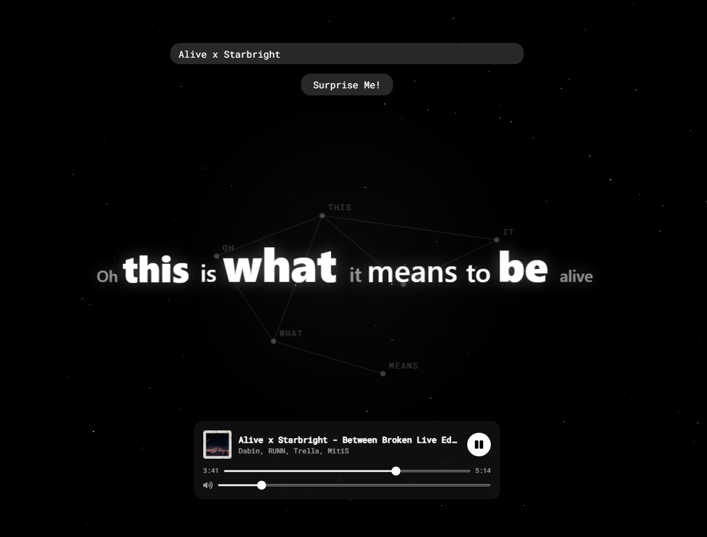
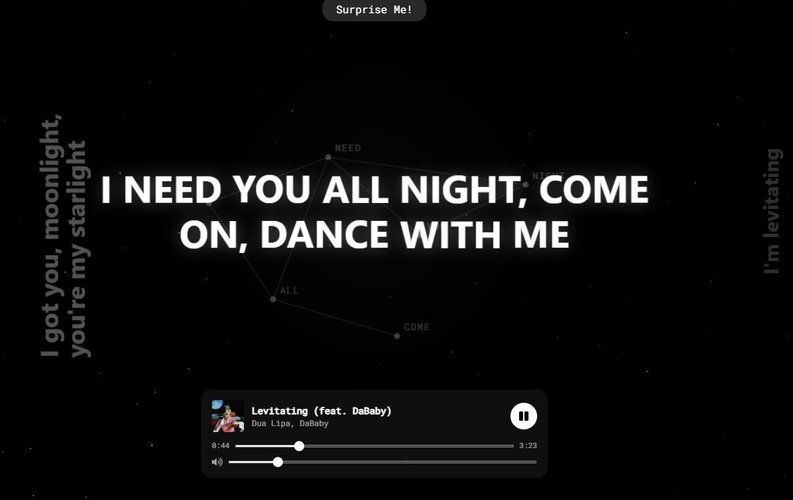
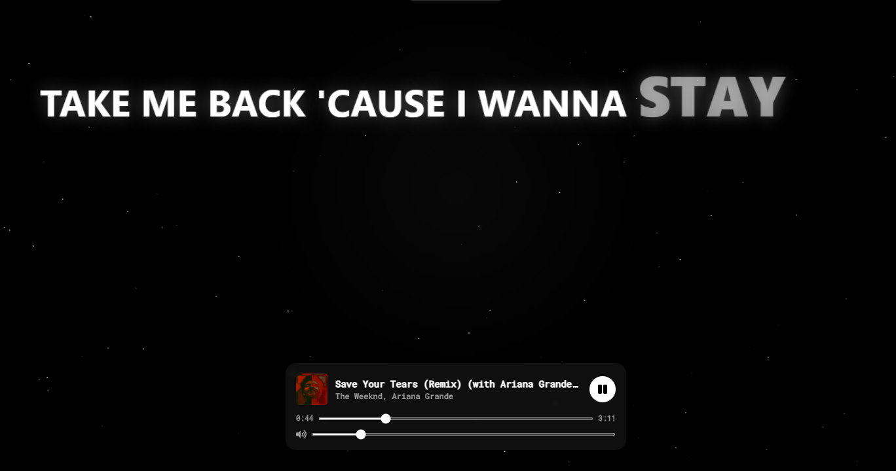
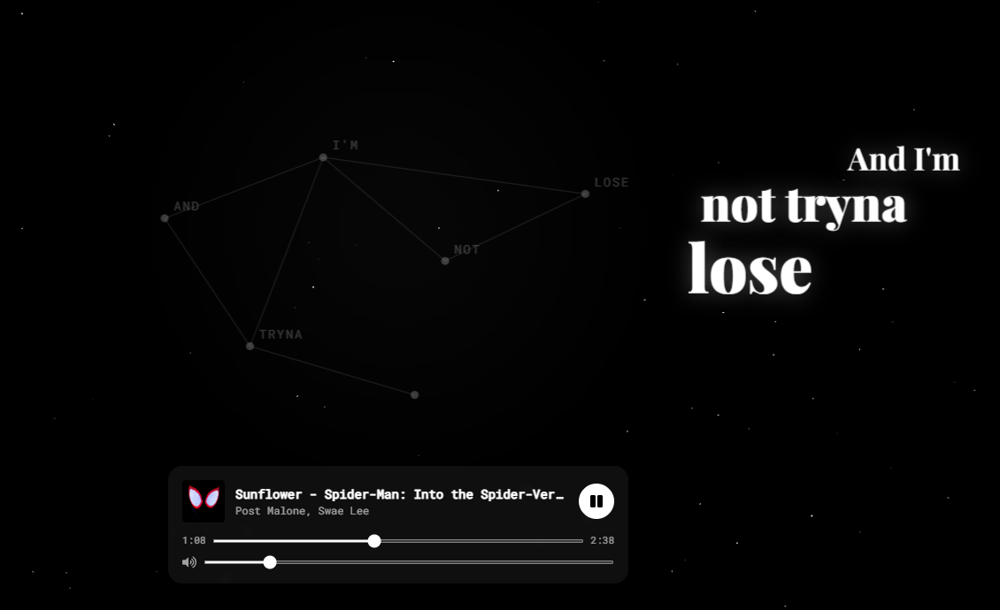

# Verseflow

A web app inspired by [Lyric Speaker / COTODAMA](https://lyric-speaker.com/) boxes that turns
any song into a **kinetic lyric stage** — words animate in, shift position, tilt, and react to
the music over generative graphics. Connect your Spotify account, search for a track (or hit
**Surprise Me!**), and watch the lyrics come alive in sync with playback.

> Built with React. Native **iOS & Android** apps are planned to expand the platform.

## Sample Screenshots

| | |
| --- | --- |
| <br/>*Mixed big/small words + word constellation* | <br/>*Big type with the 90° rotated prev/next columns* |
| <br/>*Last-word emphasis ("STAY")* | <br/>*Stepped cascade (down from the right)* |
### And many more animations

## Features

- **Kinetic "Lyric Speaker" lyrics** — each line is rendered with one of many COTODAMA-style
  templates: per-character entrance, mixed big/small words, huge type, a stepped cascade, a
  `/`–`\` typewriter, and a 90°-rotated previous/next layout. Templates are chosen so they
  never repeat back-to-back and never run in sequence, plus animated graphics (a constellation
  of words, a soft glow, and a per-line pulse).
- **Two playback modes**
  - **Connected (Spotify Premium):** full-song playback via the Spotify Web Playback SDK with a
    custom player — play/pause, seek, and a **volume slider** — and fully time-synced kinetic
    lyrics.
  - **Not connected:** **Surprise Me!** still works using free 30-second previews from the
    iTunes Search API, shown with normal scrolling lyrics and a prompt to connect for the full
    animated experience.
- **Spotify search** — search Spotify's full catalog of songs, artists, and albums.
- **Surprise Me!** — pulls a random track from a bundled Billboard Hot 100 list.
- **Animated background** — a `tsParticles` particle field behind the lyric stage.
- **Responsive, single-screen layout** — fits the viewport (no scroll) and scales from phone to
  desktop; honors `prefers-reduced-motion`.
- **Multi-page UI** — Home, Guide, About, Connect Spotify, Privacy, and Terms pages.

## Tech stack

| Area              | Choice                                                                  |
| ----------------- | ----------------------------------------------------------------------- |
| Framework         | [React 18](https://react.dev/) (Create React App + [CRACO](https://craco.js.org/)) |
| Routing           | [React Router v6](https://reactrouter.com/)                             |
| Styling           | [Tailwind CSS](https://tailwindcss.com/) + custom CSS keyframes         |
| Auth              | Spotify Authorization Code flow with **PKCE** (no client secret)        |
| Catalog / search  | [Spotify Web API](https://developer.spotify.com/documentation/web-api)  |
| Full playback     | [Spotify Web Playback SDK](https://developer.spotify.com/documentation/web-playback-sdk) (Premium) |
| Preview fallback  | [iTunes Search API](https://developer.apple.com/library/archive/documentation/AudioVideo/Conceptual/iTuneSearchAPI/) — free 30s previews, no key |
| Lyrics            | [LRCLIB](https://lrclib.net) — free, no API key, time-stamped LRC       |
| Background        | [react-tsparticles](https://github.com/tsparticles/react)              |

> **Notes:** Lyrics come from LRCLIB (free, key-less synced lyrics). Full-song
> playback uses the Web Playback SDK and **requires a Spotify Premium account**; free accounts
> fall back to 30-second iTunes previews. Because the Spotify app runs in **Development Mode**,
> only up to **25 manually allow-listed Spotify accounts** can connect — see
> [Spotify Development Mode](#️-spotify-development-mode--who-can-connect) below.

## How it works

1. **Connect Spotify** — Authorization Code + PKCE flow, entirely in the browser with no backend
   and no client secret. Tokens live in `localStorage` and refresh automatically
   (`src/services/spotifyAuth.js`). Scopes include `streaming` for the Web Playback SDK.
2. **Find a track** — your search (or a random Billboard pick) is matched against the Spotify Web
   API for the URI, artwork, and duration (`src/services/spotifyApi.js`). When Spotify isn't
   connected, **Surprise Me!** resolves a free preview via the iTunes Search API
   (`src/services/itunes.js`).
3. **Play it**
   - *Premium:* a Web Playback SDK device named **Verseflow** is created and the track is started
     on it; the player emits state changes (position, duration, paused) (`SpotifyPlayer.js`).
   - *Preview:* a native `<audio>` element plays the 30s clip and emits the same progress shape
     (`PreviewPlayer.js`).
4. **Sync the lyrics** — time-stamped LRC lyrics are fetched from LRCLIB and parsed into
   `{ time, text }` lines (`src/services/lyrics.js`). A `requestAnimationFrame` clock interpolates
   between sparse player updates so the active line stays in sync (`SearchMenu.js` +
   `LyricsDisplay.js`). Connected playback gets the kinetic stage; previews get normal scrolling
   lyrics.

## Getting started

### Prerequisites

- [Node.js](https://nodejs.org/) (LTS recommended) and npm
- A free Spotify account and a Spotify app (for the Client ID)
- **Spotify Premium** for full in-app song playback (free accounts still get 30s previews)

### 1. Install dependencies

```bash
npm install
```

### 2. Configure Spotify

Create a free app at the [Spotify Developer Dashboard](https://developer.spotify.com/dashboard)
and add this **exact** Redirect URI to it:

```
http://127.0.0.1:3000/callback
```

> Spotify no longer accepts `localhost` for new apps — use the `127.0.0.1` loopback IP and
> open the app at `http://127.0.0.1:3000`.

Then copy the env template and fill in your Client ID:

```bash
cp .env.example .env
```

```env
REACT_APP_SPOTIFY_CLIENT_ID=your_client_id_here
REACT_APP_SPOTIFY_REDIRECT_URI=http://127.0.0.1:3000/callback
```

The Client ID is **not** a secret in the PKCE flow, so it's safe to expose in the browser.
Do **not** add a client secret — it isn't used. `.env` also carries a couple of optional
dev-speed flags (`GENERATE_SOURCEMAP=false`, `ESLINT_NO_DEV_ERRORS=true`).

> ### ⚠️ Spotify Development Mode — who can connect
>
> New Spotify apps start in **Development Mode**, which **only allows up to 25 users that you
> manually allow-list**. Any other Spotify account that tries to connect gets:
>
> ```
> Spotify API 403: The user is not registered for this application.
> ```
>
> This is a Spotify platform restriction, **not** a bug in Verseflow. To let someone connect:
>
> 1. Open the [Spotify Developer Dashboard](https://developer.spotify.com/dashboard) → your app.
> 2. Go to **Settings → User Management**.
> 3. Add each person's **name** and the **email on their Spotify account** (max 25).
>
> Your own developer account is allow-listed automatically.
>
> **Opening it to *everyone*** would require **Extended Quota Mode**. Spotify has **removed the
> self-service request for individual / hobby apps** — there is no "Request Extension" button on
> a personal app, and the option only surfaces for apps tied to a qualifying business that meets
> Spotify's review and usage requirements. In practice, a personal project like Verseflow stays
> in Development Mode and is limited to the 25 allow-listed accounts above.

### 3. Run

```bash
npm start
```

Open [http://127.0.0.1:3000](http://127.0.0.1:3000) (not `localhost`, so the Spotify redirect
matches).

## Available scripts

| Command         | Description                                          |
| --------------- | ---------------------------------------------------- |
| `npm start`     | Run the app in development mode.                     |
| `npm run build` | Build a production bundle into `build/`.             |
| `npm test`      | Launch the test runner in watch mode.                |

## Project structure

```
src/
├── App.js                       # Routes
├── index.js / index.css         # Entry point + Tailwind + lyric animation keyframes
├── data/
│   └── billboardHot100.js       # "Surprise Me!" song pool
├── services/
│   ├── spotifyAuth.js           # PKCE login, token storage & refresh
│   ├── spotifyApi.js            # Spotify Web API (search + start playback)
│   ├── itunes.js                # Free 30s preview lookup (iTunes Search API)
│   └── lyrics.js                # LRCLIB fetch + LRC parsing
└── components/
    ├── HomePage.js, Navbar.js, Footer.js, Particle.jsx, Callback.js
    ├── MenuPages/               # About, Guide, Privacy, TnS, connectSpotify
    └── SearchPageComponents/
        ├── SearchPage.js        # Search page layout
        ├── SearchMenu.js        # Search/playback orchestration + playback clock
        ├── SpotifyPlayer.js     # Web Playback SDK player (full songs, Premium)
        ├── PreviewPlayer.js     # <audio> player for free 30s previews
        └── LyricsDisplay.js     # Kinetic lyric templates + graphics + plain scroll
```

## Roadmap

- Native **iOS** and **Android** apps for cross-platform versatility.
- More lyric templates, graphic variants, and color themes.

## Acknowledgements

- Inspired by [Lyric Speaker / COTODAMA](https://lyric-speaker.com/).
- Lyrics by [LRCLIB](https://lrclib.net) · Catalog & playback by
  [Spotify](https://developer.spotify.com/) · Previews by the
  [iTunes Search API](https://developer.apple.com/).
```
